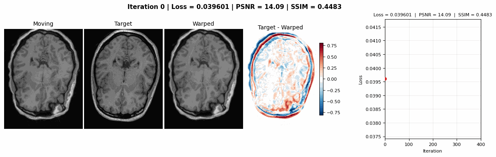

# 3D Volume Registration via GA-Planes DVF

Non-rigid 3D image-space volume registration using Geometric Algebra (GA) Plane representation.



## Repository Layout
* `src/model.py`: Implementation of the multi-resolution GA-Planes network.
* `src/registration.py`: Backward-warping fields, analytical Jacobian determinant computation, and TV loss steps.
* `src/utils.py`: Logging pipelines and central slice extraction routines across multi-planar projections.
* `main.py`: Central training loop defining parameter constants and tracking workflows.

## Features
* **Image Space Tracking**: Directly optimizes Mean Squared Error (MSE) constraints across moving and target volume boundaries.
* **Regularization Mechanics**: Blends analytical 3x3 deformation Jacobian determinant constraints with direct field and grid Total Variation penalties.
* **Resolution Schedules**: Dynamically samples low-resolution proxy grids down-stream during early optimization iterations to bypass local minima.
* **Static Fallback Compatibility**: Preserves dynamic placeholder layouts internally to switch smoothly to hypervolume data loops if temporal parameters change.

## Installation

```bash
pip install -r requirements.txt
```

## Data

```text
data/
├── moving_volume.pt
└── target_volume.pt
```

Tensor format:

```python
(1,1,D,H,W)
```

## Create Synthetic Moving Volume

```bash
python src/create_synthetic_moving.py
```

## Run

```bash
python main.py
```

## Hydra Overrides Example

```bash
python main.py \
    training.iterations=500 \
    training.learning_rate=5e-5 \
    model.Np_list=[64,32] \
    model.Nl_list=[128,64] \
    model.C_list=[16,16]
```

## Outputs

```text
outputs/

├── progress/
│   ├── progress_iter_0000.png
│   ├── progress_iter_0010.png
│   └── ...

├── optimization.gif

├── final_dvf.pt

└── run_log.json
```

