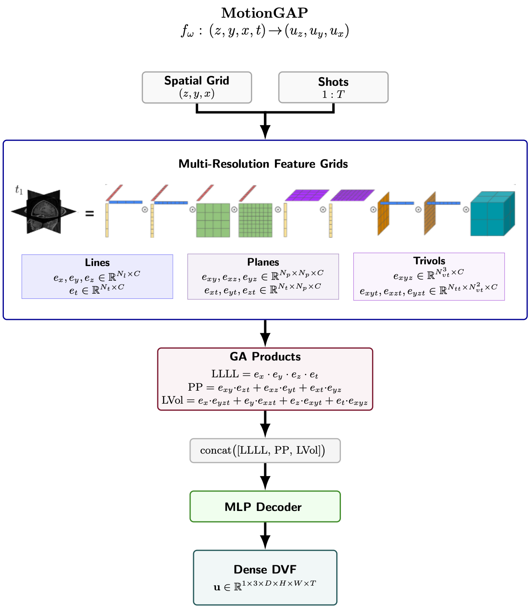

# Non-Rigid 3D Volume Registration via GA-Planes

<p align="center">
  
</p>


## Overview

GA-Planes-DVF is an implicit neural representation framework for **non-rigid 3D volume registration**. A Deformation Vector Field (DVF) $\mathbf{u} : \mathbb{R}^3 \to \mathbb{R}^3$ is parameterized by a multi-resolution Geometric Algebra Planes (GA-Planes) network and optimized directly in image space by minimizing the mean squared error (MSE) between a warped moving volume and a fixed target volume.

The architecture natively supports **4D (3D + time)** fields, enabling motion compensation across multiple acquisitions or respiratory phases.

> **MotionGAP: Non-Rigid Motion Compensated 3D Brain MRI Reconstruction via Implicit Neural Volumes** *(coming soon)*
>
> Built on top of [GA-Planes: Geometric Algebra Planes — Convex Implicit Neural Volumes](https://arxiv.org/abs/2411.13525) [1] and [MotionDPS: Motion-Compensated 3D Brain MRI Reconstruction](https://arxiv.org/html/2605.22121) [2].

---

<p align="center">
  
</p>

*Figure: MotionGAP pipeline. Spatial coordinates (z, y, x) and a shot index $t$ are encoded by multi-resolution feature grids (lines, planes, trivols). GA outer products combine the features, which are decoded by a small MLP to produce the dense DVF.*

---

## Background: GA-Planes

### Feature Grid Factorization

GA-Planes decomposes a 4D implicit field into a hierarchy of low-dimensional, learnable feature grids. Given coordinates $(z, y, x, t)$, features are interpolated from three families of grids at each resolution level $\ell$:

**Lines** (1-D grids along each axis):

$$e_x, e_y, e_z \in \mathbb{R}^{N_l \times C}, \quad e_t \in \mathbb{R}^{N_t \times C}$$

**Planes** (2-D grids for each axis pair):

$$e_{xy},\, e_{xz},\, e_{yz} \in \mathbb{R}^{N_p \times N_p \times C}, \quad e_{xt},\, e_{yt},\, e_{zt} \in \mathbb{R}^{N_t \times N_p \times C}$$

**Trivols** (3-D spatial and spatio-temporal volumes):

$$e_{xyz} \in \mathbb{R}^{N_{vt}^3 \times C}, \quad e_{xyt},\, e_{xzt},\, e_{yzt} \in \mathbb{R}^{N_{tt} \times N_{vt}^2 \times C}$$

### Geometric Algebra Products

Interpolated features are combined via element-wise Geometric Algebra (GA) outer products before decoding. In the non-convex mode used here, three product terms are computed:

$$\text{LLLL} = e_x \cdot e_y \cdot e_z \cdot e_t$$

$$\text{PP} = e_{xy} \cdot e_{zt} + e_{xz} \cdot e_{yt} + e_{xt} \cdot e_{yz}$$

$$\text{LVol} = e_x \cdot e_{yzt} + e_y \cdot e_{xzt} + e_z \cdot e_{xyt} + e_t \cdot e_{xyz}$$

These are concatenated and decoded by an MLP:

$$\mathbf{u}(z, y, x, t) = \text{MLP}\left(\text{concat}[\,\text{LLLL},\, \text{PP},\, \text{LVol}]\right)$$

### DVF Parameterization and Warping

The network materializes a dense DVF $\mathbf{u} \in \mathbb{R}^{1 \times 3 \times D \times H \times W}$ over the full spatial grid. Backward warping maps the moving image $I_M$ to the target $I_T$ via:

$$\hat{I}_M(\mathbf{p}) = I_M\left(\mathbf{p} + \mathbf{u}(\mathbf{p})\right)$$

where $\mathbf{p} = (z, y, x)$ indexes voxel positions.

### Loss Function

The optimization objective consists of an image similarity term (MSE) and an optional regularization term:

$$\mathcal{L}=\underbrace{\|\hat{I}_M - I_T\|_2^2}_{\text{MSE}}+\lambda_{\mathrm{reg}}\mathcal{L}_{\mathrm{reg}}$$

where $\mathcal{L}_{\mathrm{reg}}$ may include one or more of the following regularizers:
- **Jacobian penalty** $\mathcal{L}_{\text{jac}}$: 
penalizes $(\log \det J_{\mathbf{u}})^2$ and negative Jacobian determinants to discourage folding and non-invertible deformations.

- **DVF TV** $\mathcal{L}_{\text{dvf-TV}}$: 
total variation regularization on the materialized displacement vector field to encourage spatial smoothness.


When no regularization is used $(\lambda_{\mathrm{reg}} = 0$), the objective reduces to the MSE loss alone.

### Multi-Resolution Schedule for speedup (Optional)

Early iterations operate on a low-resolution proxy DVF (downsampled by `scale` $\in (0, 1]$) before progressively switching to the full-resolution field:

| Fraction of iterations | DVF scale |
|---|---|
| 0 – 50% | 0.25× |
| 50 – 90% | 0.50× |
| 90 – 100% | 1.00× |

---

## Repository Layout

```
.
├── configs/
│   └── config.yaml          # Hydra configuration
├── data/
│   ├── moving_volume.pt
│   └── target_volume.pt
├── docs/
│   └── figures/
│   │    └── MotionGAP_architecture.png 
│   └── images/
│        └── optimization_example.gif
├── src/
│   ├── model.py             # GA-Planes DVF network
│   ├── registration.py      # Warping, Jacobian, TV losses, resolution schedule
│   ├── utils.py             # Logging, checkpoint slices, GIF creation
│   └── create_synthetic_moving.py
├── main.py                  # Training loop (Hydra entry point)
├── requirements.txt
└── LICENSE
```

---

## Installation

```bash
git clone <repo-url>
cd motiongap
pip install -r requirements.txt
```

---

## Data

Volumes must be PyTorch tensors of shape `(1, 1, D, H, W)` saved with `torch.save`:

```
data/
├── moving_volume.pt
└── target_volume.pt
```

The example volume used in this repository is a sample from the [Calgary Campinas Brain MRI Dataset (CC59)](https://portal.conp.ca/dataset?id=projects/calgary-campinas#) [3] with size $256 \times 218 \times 170$.

For the provided configuration, peak GPU memory usage is approximately 39GB and runtime less than 5 minutes on a NVIDIA A100. Users with more limited hardware resources may need to reduce the volume resolution or grid resolution.

### Create Synthetic Moving Volume

Generates a moving volume from an existing target by applying a random smooth deformable DVF combined with a small rigid body transform (rotation + translation):

```bash
python src/create_synthetic_moving.py
```

---

## Run

```bash
python main.py
```

### Hydra Override Examples

```bash
# More iterations, finer grids
python main.py \
    training.iterations=500 \
    training.learning_rate=5e-4 \
    model.Np_list=[64,32] \
    model.Nl_list=[128,64] \
    model.C_list=[16,16]

# Enable cosine LR schedule
python main.py \
    training.lr_scheduler.enable=true \
    training.lr_scheduler.type=cosine \
    training.lr_scheduler.eta_min=1e-6
```

---

## Configuration Reference

Key parameters in `configs/config.yaml`:

| Parameter | Description |
|---|---|
| `model.mode` | Decoder mode: `nonconvex` / `semiconvex` / `convex` |
| `model.Np_list` | Plane grid resolutions per level |
| `model.Nl_list` | Line grid resolutions per level |
| `model.C_list` | Feature channel counts per level |
| `model.use_trivols` | Enable 3-D trivol grids |
| `model.use_hypervol` | Enable 4-D hypervolume grid |
| `model.max_amplitude` | DVF output clamp (voxels) |
| `loss.lambda_jacobian` | Weight for Jacobian determinant penalty |
| `loss.lambda_grid_tv` | Weight for feature grid TV loss |
| `loss.lambda_dvf_tv` | Weight for DVF TV loss |
| `schedule.enabled` | Enable multi-resolution coarse-to-fine schedule |

---

## Outputs

```
outputs/
├── checkpoints/
│   ├── progress_0000.png    # Middle-slice comparison (target / moving / warped / error)
│   └── ...
├── dvf_slices/
│   ├── dvf_0000.png         # Orthogonal DVF component maps + vector fields
│   └── ...
├── frames/
│   ├── frame_0000.png       # Optimization frame (images + live loss curve)
│   └── ...
├── optimization.gif          # Timelapse GIF of training
├── final_dvf.pt              # Saved DVF tensor (1, 3, D, H, W)
└── run_log.json              # Full per-iteration metrics and run parameters
```

---

## References
- [1] Sivgin et al. "Geometric Algebra Planes: Convex Implicit Neural Volumes". In: *arXiv:2411.13525* (2024). 
- [2] Ortiz-Gonzalez et al. "MotionDPS: Motion-Compensated 3D Brain MRI Reconstruction". In: *arXiv:2605.22121v1* (2026). 
- [3] Souza et al. "An Open, Multi-Vendor, Multi-Field-Strength Brain MR Dataset and Analysis of Publicly Available Skull Stripping Methods Agreement". In: *NeuroImage* (2018).


---

## Citation

If you use this work, please cite:

```bibtex
@misc{motiongap2026,
  title   = {MotionGAP: Non-Rigid Motion Compensated 3D Brain MRI Reconstruction via Implicit Neural Volumes},
  author  = {Stefan Luger},
  year    = {2026},
  note    = {Coming soon}
}
```

---

## License

This project is licensed under the MIT License. See [LICENSE](LICENSE) for details.
